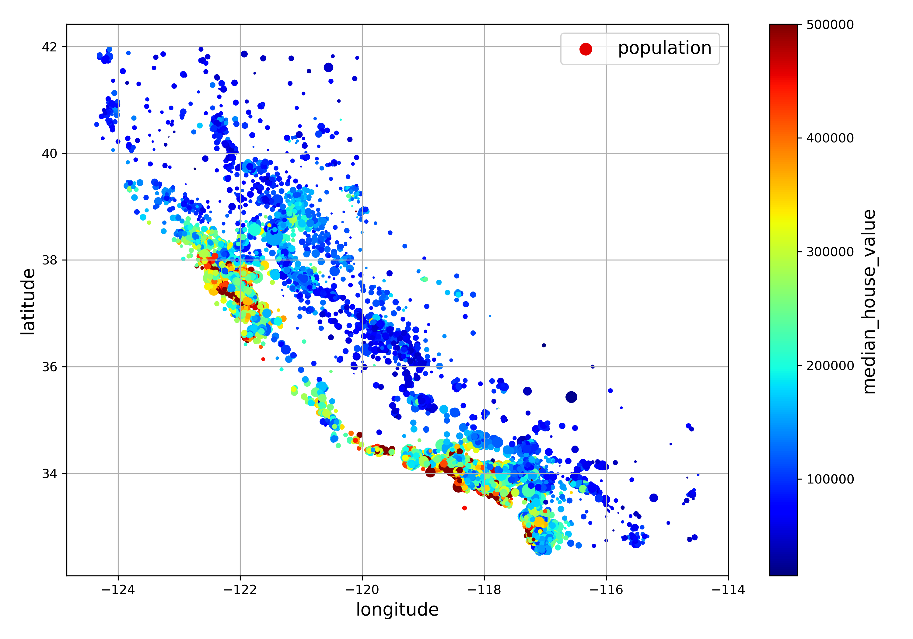

[![LinkedIn][linkedin-shield]][linkedin-url]
<!-- PROJECT TITLE -->

<h1 align="center"> Housing Price Predication with Machine Learning </h1>

An end-to-end machine learning project that uses California census data (1990) to build a model of housing prices. The data includes 
**longitude**, **latitude**, **housing_median_age**, **total_rooms**, **total_bedrooms**, **population**, **households**, 
**median_income**, **median_house_value**, and **ocean_proximity** for each district. The model should
learn from this data and be able to predict the median housing price in any district given
all the other metrics mentioned above.

## Project Checklist

### 1. Establishing the problem frame

- The model outputs (predictions of median housing price for each district) should be able to be fed into another machine learning system.
- The current solution involves manually calculate the median housing prices with complex formula; it is
time-consuming and the estimates are not ideal (off by ~30%).
- Since the inputs are labeled with expected outputs, this is a **supervised learning** task. Moreover, it
is a **regression problem** since the expected outputs are values.
- The model will be trained with **batch learning** since there is no constant update 
of the data, and the data size considerably small.
- The **root-mean-square error (RMSE)** will be used to evaluate the performance of the regression problem since the amount of outlier data are not significant.

### 2. Acquiring the data

- The data of this project is available at: https://github.com/ageron/data/raw/main/housing.tgz.
- Several methods from `pandas` library can be used to take a quick look at the data, such as `.head()`, 
`.info()`, `.describe()`, and `.hist()`.
- There are some null data in **total_bedrooms** column of the data.
- Attributes for **ocean_proximity** are categorical instead of numerical.
- **median_income** are scaled to tens thousands of dollars and is capped from 0.5 to 15.
- **housing_median_age** is capped at 50 years, 
and **median_housing_value** is capped at $500,000.
- These constraints have to be taken into account when making any prediction beyond the capped values.
If so, the capped values need to be either removed or reevaluated.
- From histograms, many data are *skewed right*, which can make machine learning algorithms hard
to detect patterns. A transformation will be needed.
- - To avoid sampling bias, stratified sampling needs to be implemented.
- `.cut()` method from `pandas` library is used to create the income category.
- Creating training and test sets by using `train_test_split()` function from `sklearn.model_selection` utility.

### 3. Gaining insight from the data

- Housing prices are closely related to the location and population density.
- The data's linear correlations can be checked with `.corr()` method from `pandas` library and 
range from -1 (strong negative correlation) to 1 (strong positive correlation).
- `scatter_matrix` from `pandas.plotting` utility can also be used to visualize the correlations.
- The most promising attribute to predict **median_house_value** is found to be **median_income**.
- **total_rooms** and **total_bedrooms** in a district alone is not useful. More insights may be obtained by dividing them with **households**.

### 4. Preprocessing the data

- 

### 5. Choosing a model

-

### 6. Fine-tuning the model

-

### 7. Presenting the solution

-

### 8. Launching, monitoring, and maintaining the system

-

<!-- MARKDOWN LINKS & IMAGES -->
<!-- https://www.markdownguide.org/basic-syntax/#reference-style-links -->
[linkedin-shield]: https://img.shields.io/badge/-LinkedIn-black.svg?style=for-the-badge&logo=linkedin&colorB=555
[linkedin-url]: https://www.linkedin.com/in/colin-z/
